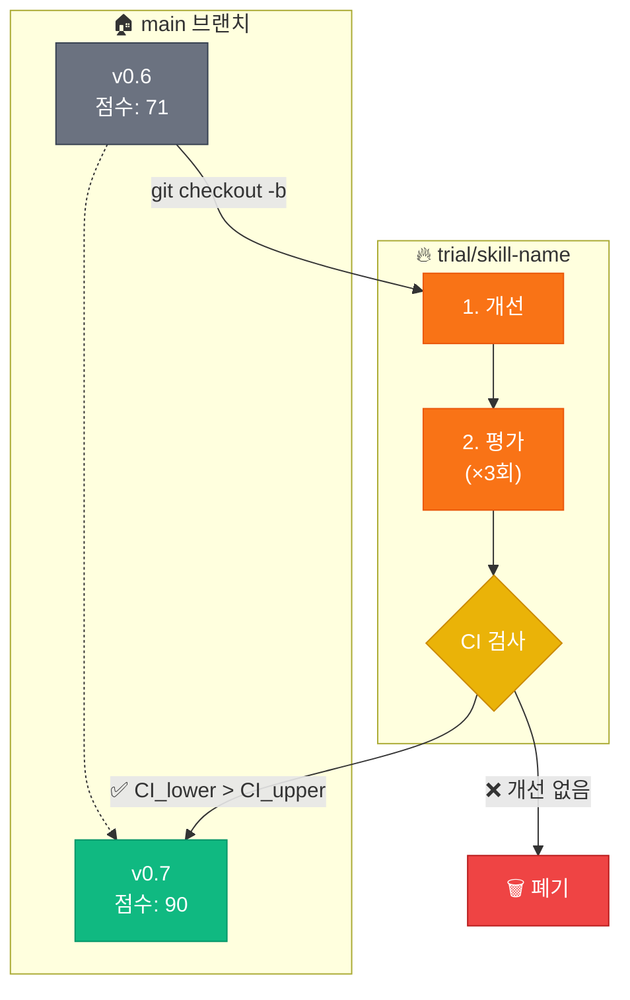

[English](README.md) | **한국어**

<div align="center">

```
                    ╔═══════════════════════════════════════╗
                    ║                                       ║
        ⚒️          ║     S K I L L   F O R G E            ║          🔥
                    ║                                       ║
                    ╚═══════════════════════════════════════╝
                                    ▲
                               ╱────┴────╲
                              ╱           ╲
                             ▕  ▓▓▓▓▓▓▓▓▓  ▏    ← 모루
                              ╲___________╱
```

### 불꽃 속에서 AI 스킬을 단조하다

**Claude Code를 위한 TDD 기반 스킬 자동 업그레이드 플러그인**

[](LICENSE)
[](https://github.com/quantsquirrel/claude-skill-forge)
[](https://claude.ai)
[](https://github.com/quantsquirrel/claude-skill-forge)
[](https://github.com/quantsquirrel/claude-skill-forge)

<br/>

> *"마스터 대장장이가 강철을 담금질하듯, skill-forge는 당신의 AI 스킬을*
> *달구고, 두드리고, 식혀서 더 강하게 만듭니다."*

<br/>

[⚡ 빠른 시작](#-대장간에-불을-지피다) · [🔥 단조 과정](#-단조-과정) · [📊 결과](#-불꽃의-증거)

</div>

---

<table>
<tr>
<td width="50%">

### 🏛️ 검증된 이론 기반

| 기반 이론 | 핵심 통찰 |
|:----------|:----------|
| **Gödel Machines** | 증명 가능한 자기 개선 |
| **Dynamic Gödel** | 동적 환경에서 적응 |
| **TDD 안전성** | 테스트가 변경 경계 정의 |
| **통계적 엄밀성** | 95% 신뢰구간 검증 |

</td>
<td width="50%">

### 📊 불꽃의 증거

```
단조 전:   ████████░░░░░░░░  71점
단조 후:   ██████████████░░  90점
                        ▲
                   +27% 향상
```

*skill-forge는 자기 자신을 단조했습니다* (부트스트래핑)

</td>
</tr>
</table>

---

## ⚡ 대장간에 불을 지피다

```bash
# 대장간을 작업실로 소환
git clone https://github.com/quantsquirrel/claude-skill-forge.git \
  ~/.claude/plugins/local/skill-forge

# 첫 번째 불꽃을 일으키다
/skill-forge:forge --scan
```

---

## 🔥 단조 과정

<div align="center">

```
    원재료 스킬                   단조된 스킬
        │                             ▲
        ▼                             │
   ┌─────────┐    ┌─────────┐    ┌─────────┐
   │  달구기  │───▶│  두드리기│───▶│  담금질  │
   │         │    │         │    │         │
   │ 분석    │    │ 개선    │    │ 검증    │
   │ & 계획  │    │ & 테스트 │    │ & 병합  │
   └─────────┘    └─────────┘    └─────────┘
       🔥             ⚒️             💧
```

</div>

### 🔥 달구기: TDD-Fit 평가

스킬이 대장간에 들어가기 전, 열 테스트를 통과해야 합니다:

```
 ╭──────────────────────────────────────────╮
 │  ☑ 테스트가 있는가?               → YES  │
 │  ☑ 테스트가 재현 가능한가?        → YES  │
 │  ☑ 개선 대상이 명확한가?          → YES  │
 │  ☑ 기존 기능을 깨뜨리지 않는가?   → YES  │
 │  ☑ 크기가 작은가? (<500줄)        → YES  │
 ├──────────────────────────────────────────┤
 │  ✅ TDD-Fit 인증 — 단조 준비 완료        │
 ╰──────────────────────────────────────────╯
```

### ⚒️ 두드리기: Trial Branch 전략

스킬은 안전을 위해 별도의 모루(브랜치)에서 단조됩니다:



### 💧 담금질: 통계적 검증

통계적으로 유의미한 개선만 살아남습니다:

<table>
<tr>
<th>전략</th>
<th>세부 사항</th>
</tr>
<tr>
<td><b>3× 독립 평가</b></td>
<td>분리된 에이전트가 편향 방지</td>
</tr>
<tr>
<td><b>95% 신뢰구간</b></td>
<td>운이 아닌 통계적 엄밀성</td>
</tr>
<tr>
<td><b>병합 임계값</b></td>
<td><code>CI_lower(신규) > CI_upper(기존)</code></td>
</tr>
</table>

---

## ⚔️ 품질 점수화

각 스킬은 5가지 차원에서 평가됩니다:

```
┌────────────────────────────────────────────────────────┐
│                                                        │
│  테스트 통과율   ████████████████████████████░░  30%   │
│  코드 명확성     ████████████████████░░░░░░░░░░  20%   │
│  성능           ████████████████████░░░░░░░░░░  20%   │
│  완전성         ████████████████████░░░░░░░░░░  20%   │
│  유지보수성     ██████████░░░░░░░░░░░░░░░░░░░░  10%   │
│                                                        │
│  총점           ████████████████████████████░░  90    │
│                                                        │
└────────────────────────────────────────────────────────┘
```

---

## 🛡️ 안전 메커니즘

<table>
<tr>
<td align="center" width="25%">

**🔄 안전한 롤백**

실패 시 Trial 브랜치 삭제

</td>
<td align="center" width="25%">

**🔒 원본 보존**

소스 스킬 절대 건드리지 않음

</td>
<td align="center" width="25%">

**📝 실패 기록**

실패에서 배우기

</td>
<td align="center" width="25%">

**⏱️ 최대 6회 반복**

과최적화 방지

</td>
</tr>
</table>

---

## 📦 설치

<details>
<summary><b>방법 1: 자동 로드 (권장)</b></summary>

```bash
git clone https://github.com/quantsquirrel/claude-skill-forge.git \
  ~/.claude/plugins/local/skill-forge
```

</details>

<details>
<summary><b>방법 2: 수동 설치</b></summary>

```bash
mkdir -p ~/.claude/plugins/local/skill-forge
cp -r skill-forge/* ~/.claude/plugins/local/skill-forge/
chmod +x ~/.claude/plugins/local/skill-forge/hooks/*.sh
```

</details>

---

## 🚀 명령어

| 명령어 | 설명 |
|:-------|:-----|
| `/skill-forge:forge --scan` | 🔍 업그레이드 가능한 스킬 스캔 |
| `/skill-forge:forge <skill>` | ⚒️ 특정 스킬 단조 |
| `/skill-forge:forge --history` | 📜 단조 이력 확인 |
| `/skill-forge:forge --watch <skills>` | 👁️ 스킬 모니터링 |

### 출력 예시

```
╔══════════════════════════════════════════════════════════╗
║  [1/6] 단조 중: executor                                 ║
╠══════════════════════════════════════════════════════════╣
║                                                          ║
║  🔥 Trial 브랜치: trial/executor                         ║
║  ✓ 개선 에이전트 완료                                    ║
║    → 성능: 메모리 -20%                                   ║
║    → 명확성: 주석 추가                                   ║
║                                                          ║
║  📊 평가 (3회):                                          ║
║     1차: 78  │  2차: 81  │  3차: 79                      ║
║                                                          ║
║  📈 통계:                                                ║
║     평균: 79.3 │ 표준편차: 1.53 │ 95% CI: [76.8, 81.8]   ║
║                                                          ║
║  ⚖️ 기준선: 75 (CI: [72, 78])                            ║
║                                                          ║
║  ✅ 단조 완료                                            ║
║     CI_lower(76.8) > CI_upper(78)? YES → 병합됨          ║
║                                                          ║
╚══════════════════════════════════════════════════════════╝
```

---

## 📈 단조 이력

<table>
<tr>
<th>버전</th>
<th>점수</th>
<th>단조된 내용</th>
</tr>
<tr>
<td>v0.5</td>
<td>—</td>
<td>🌱 최초 불꽃: TDD-Fit, Trial Branch</td>
</tr>
<tr>
<td>v0.6</td>
<td>71</td>
<td>⚒️ 평가자 분리, CI 검증</td>
</tr>
<tr>
<td><b>v0.7</b></td>
<td><b>90.33</b></td>
<td>🔥 <b>+CSO 준수, +Arguments, +Prerequisites</b></td>
</tr>
<tr>
<td>v0.8+</td>
<td>🚧</td>
<td>🔮 예정: 추가 부트스트래핑</td>
</tr>
</table>

---

## 📚 전승 (참고자료)

| 고서 | 지식 |
|:-----|:-----|
| [Gödel Machines](https://arxiv.org/abs/cs/0309048) | Schmidhuber (2007) — 자기 참조 최적 에이전트 |
| Dynamic Gödel Machines | 동적 환경 적응 |
| TDD Safety | 자기 참조 루프 방지 |
| Multi-Evaluator Consensus | 합의를 통한 신뢰성 |

---

<div align="center">

```
        ╱╲
       ╱  ╲
      ╱ 🔥 ╲
     ╱      ╲
    ╱________╲
   ╱ ▓▓▓▓▓▓▓▓ ╲
  ╱____________╲
       ║║
    ═══╬╬═══
```

*"불꽃 속에서 단조된 스킬은 결코 지치지 않는다."*

---

[skill-up](https://github.com/BumgeunSong/skill-up)에서 영감을 받음

**Maintained by:** Claude Code · **License:** MIT

</div>
