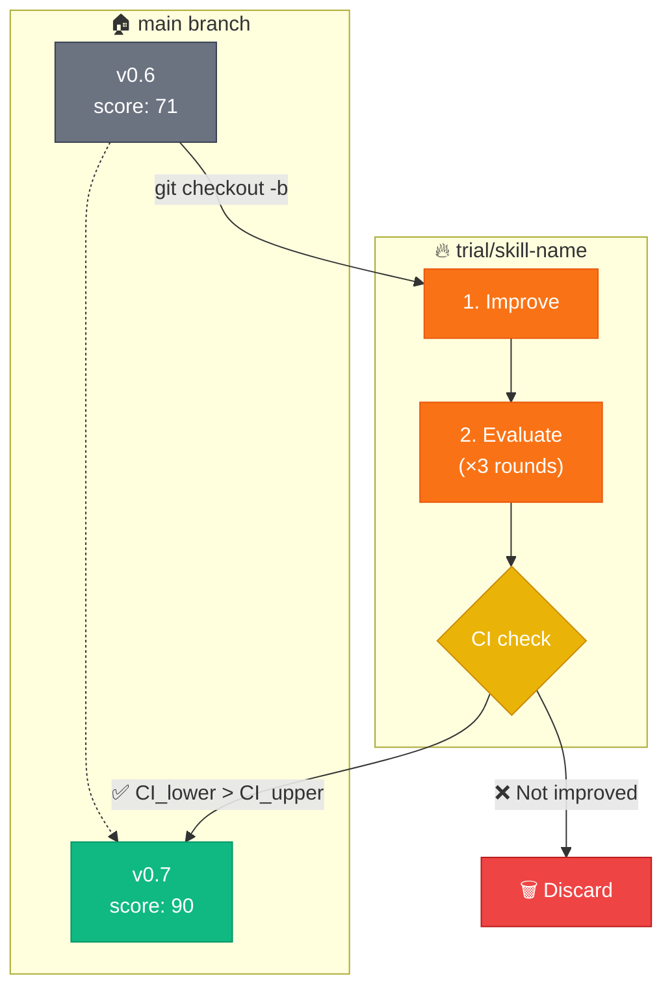

**English** | [한국어](README.ko.md)

<div align="center">

```
                    ╔═══════════════════════════════════════╗
                    ║                                       ║
        ⚒️          ║     S K I L L   F O R G E            ║          🔥
                    ║                                       ║
                    ╚═══════════════════════════════════════╝
                                    ▲
                               ╱────┴────╲
                              ╱           ╲
                             ▕  ▓▓▓▓▓▓▓▓▓  ▏    ← The Anvil
                              ╲___________╱
```

### Where AI Skills Are Forged Through Fire

**TDD-Based Automatic Skill Upgrade Plugin for Claude Code**

[](LICENSE)
[](https://github.com/quantsquirrel/claude-skill-forge)
[](https://claude.ai)
[](https://github.com/quantsquirrel/claude-skill-forge)
[](https://github.com/quantsquirrel/claude-skill-forge)

<br/>

> *"Like a master blacksmith tempering steel, skill-forge heats, hammers, and quenches*
> *your AI skills until they emerge stronger than before."*

<br/>

[⚡ Quick Start](#-ignite-the-forge) · [🔥 The Process](#-the-forging-process) · [📊 Results](#-proof-of-the-flame)

</div>

---

<table>
<tr>
<td width="50%">

### 🏛️ Built on Proven Theory

| Foundation | Insight |
|:-----------|:--------|
| **Gödel Machines** | Provable self-improvement |
| **Dynamic Gödel** | Adapt in changing environments |
| **TDD Safety** | Tests define change boundaries |
| **Statistical Rigor** | 95% confidence validation |

</td>
<td width="50%">

### 📊 Proof of the Flame

```
Before Forging:  ████████░░░░░░░░  71 pts
After Forging:   ██████████████░░  90 pts
                              ▲
                         +27% improvement
```

*skill-forge forged itself* (bootstrapping)

</td>
</tr>
</table>

---

## ⚡ Ignite the Forge

```bash
# Summon the forge to your workshop
git clone https://github.com/quantsquirrel/claude-skill-forge.git \
  ~/.claude/plugins/local/skill-forge

# Strike the first spark
/skill-forge:forge --scan
```

---

## 🔥 The Forging Process

<div align="center">

```
    RAW SKILL                    FORGED SKILL
        │                             ▲
        ▼                             │
   ┌─────────┐    ┌─────────┐    ┌─────────┐
   │  HEAT   │───▶│  HAMMER │───▶│ QUENCH  │
   │         │    │         │    │         │
   │ Analyze │    │ Improve │    │ Verify  │
   │ & Plan  │    │ & Test  │    │ & Merge │
   └─────────┘    └─────────┘    └─────────┘
       🔥             ⚒️             💧
```

</div>

### 🔥 HEAT: TDD-Fit Assessment

Before any skill enters the forge, it must pass the heat test:

```
 ╭──────────────────────────────────────────╮
 │  ☑ Has tests?                    → YES   │
 │  ☑ Tests reproducible?           → YES   │
 │  ☑ Clear improvement target?     → YES   │
 │  ☑ Won't break functionality?    → YES   │
 │  ☑ Small enough (<500 lines)?    → YES   │
 ├──────────────────────────────────────────┤
 │  ✅ TDD-Fit Certified — Ready for Forge  │
 ╰──────────────────────────────────────────╯
```

### ⚒️ HAMMER: Trial Branch Strategy

The skill is hammered on a separate anvil (branch) for safety:



### 💧 QUENCH: Statistical Validation

Only statistically significant improvements survive:

<table>
<tr>
<th>Strategy</th>
<th>Details</th>
</tr>
<tr>
<td><b>3× Independent Evaluations</b></td>
<td>Separate agents prevent bias</td>
</tr>
<tr>
<td><b>95% Confidence Interval</b></td>
<td>Statistical rigor, not luck</td>
</tr>
<tr>
<td><b>Merge Threshold</b></td>
<td><code>CI_lower(new) > CI_upper(old)</code></td>
</tr>
</table>

---

## ⚔️ Quality Scoring

Each skill is scored across five dimensions:

```
┌────────────────────────────────────────────────────────┐
│                                                        │
│  Test Pass Rate   ████████████████████████████░░  30%  │
│  Code Clarity     ████████████████████░░░░░░░░░░  20%  │
│  Performance      ████████████████████░░░░░░░░░░  20%  │
│  Completeness     ████████████████████░░░░░░░░░░  20%  │
│  Maintainability  ██████████░░░░░░░░░░░░░░░░░░░░  10%  │
│                                                        │
│  TOTAL SCORE      ████████████████████████████░░  90   │
│                                                        │
└────────────────────────────────────────────────────────┘
```

---

## 🛡️ Safety Mechanisms

<table>
<tr>
<td align="center" width="25%">

**🔄 Safe Rollback**

Trial branch deleted on failure

</td>
<td align="center" width="25%">

**🔒 Original Preserved**

Source skill never touched

</td>
<td align="center" width="25%">

**📝 Failure Logged**

Learn from what didn't work

</td>
<td align="center" width="25%">

**⏱️ Max 6 Iterations**

Prevent over-optimization

</td>
</tr>
</table>

---

## 📦 Installation

<details>
<summary><b>Option 1: Auto-load (Recommended)</b></summary>

```bash
git clone https://github.com/quantsquirrel/claude-skill-forge.git \
  ~/.claude/plugins/local/skill-forge
```

</details>

<details>
<summary><b>Option 2: Manual Installation</b></summary>

```bash
mkdir -p ~/.claude/plugins/local/skill-forge
cp -r skill-forge/* ~/.claude/plugins/local/skill-forge/
chmod +x ~/.claude/plugins/local/skill-forge/hooks/*.sh
```

</details>

---

## 🚀 Commands

| Command | Description |
|:--------|:------------|
| `/skill-forge:forge --scan` | 🔍 Scan for upgradeable skills |
| `/skill-forge:forge <skill>` | ⚒️ Forge a specific skill |
| `/skill-forge:forge --history` | 📜 View forging history |
| `/skill-forge:forge --watch <skills>` | 👁️ Monitor skills |

### Example Output

```
╔══════════════════════════════════════════════════════════╗
║  [1/6] Forging: executor                                 ║
╠══════════════════════════════════════════════════════════╣
║                                                          ║
║  🔥 Trial Branch: trial/executor                         ║
║  ✓ Improvement agent completed                           ║
║    → Performance: -20% memory                            ║
║    → Clarity: Added comments                             ║
║                                                          ║
║  📊 Evaluation (3 rounds):                               ║
║     Round 1: 78  │  Round 2: 81  │  Round 3: 79          ║
║                                                          ║
║  📈 Statistics:                                          ║
║     Mean: 79.3 │ StdDev: 1.53 │ 95% CI: [76.8, 81.8]     ║
║                                                          ║
║  ⚖️ Baseline: 75 (CI: [72, 78])                          ║
║                                                          ║
║  ✅ FORGING COMPLETE                                     ║
║     CI_lower(76.8) > CI_upper(78)? YES → Merged          ║
║                                                          ║
╚══════════════════════════════════════════════════════════╝
```

---

## 📈 Forging History

<table>
<tr>
<th>Version</th>
<th>Score</th>
<th>What Was Forged</th>
</tr>
<tr>
<td>v0.5</td>
<td>—</td>
<td>🌱 Initial spark: TDD-Fit, Trial Branch</td>
</tr>
<tr>
<td>v0.6</td>
<td>71</td>
<td>⚒️ Evaluator separation, CI validation</td>
</tr>
<tr>
<td><b>v0.7</b></td>
<td><b>90.33</b></td>
<td>🔥 <b>+CSO compliance, +Arguments, +Prerequisites</b></td>
</tr>
<tr>
<td>v0.8+</td>
<td>🚧</td>
<td>🔮 Future: Additional bootstrapping</td>
</tr>
</table>

---

## 📚 The Lore (References)

| Tome | Knowledge |
|:-----|:----------|
| [Gödel Machines](https://arxiv.org/abs/cs/0309048) | Schmidhuber (2007) — Self-referential optimal agents |
| Dynamic Gödel Machines | Adaptation in dynamic environments |
| TDD Safety | Self-referential loop prevention |
| Multi-Evaluator Consensus | Reliability through agreement |

---

<div align="center">

```
        ╱╲
       ╱  ╲
      ╱ 🔥 ╲
     ╱      ╲
    ╱________╲
   ╱ ▓▓▓▓▓▓▓▓ ╲
  ╱____________╲
       ║║
    ═══╬╬═══
```

*"A skill forged in fire is a skill that will never tire."*

---

Inspired by [skill-up](https://github.com/BumgeunSong/skill-up)

**Maintained by:** Claude Code · **License:** MIT

</div>
